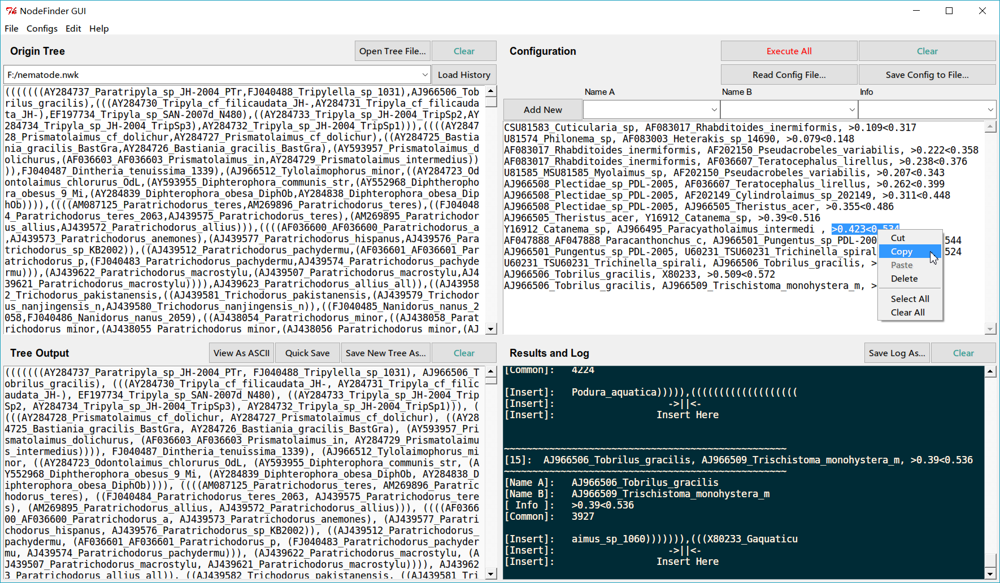

NodeFinderGUI
=============
GUI for NodeFinder Program

Introduction
------------

This is GUI implementation  for NodeFinder program, used for adding information to
bipartition/multifurcating Newick format phylogenetic tree:

1. Calibration info;
2. Clade Label;
3. Branch Label

Download
--------

For **Windows** users, you can just download the latest compiled byte code pyw file ([nodefinder_gui.latest.pyw](https://raw.githubusercontent.com/zxjsdp/NodeFinderGUI/master/latest_pyw/nodefinder_gui.latest.pyw)), then double click to run it.

For **Linux** and **MacOS** users, you can also try [nodefinder_gui.latest.pyw](https://raw.githubusercontent.com/zxjsdp/NodeFinderGUI/master/latest_pyw/nodefinder_gui.latest.pyw), or download [nodefinder_gui/nodefinder_gui.py](https://raw.githubusercontent.com/zxjsdp/NodeFinderGUI/master/nodefinder_gui/nodefinder_gui.py) and run it.

Compiled byte code `.pyw` file in the [latest_pyw](https://github.com/zxjsdp/NodeFinderGUI/tree/master/latest_pyw) folder is a `.pyc` file that was compiled by the Python interpreter to byte code, then changed extension to `.pyw`. It's faster to launch on slow computers since no more `source code -> byte code` procedure need to be done.

Command Line Version
--------------------
[NodeFinderC](https://github.com/zxjsdp/nodefinderc) (recommended), C implementation of NodeFinder.

[NodeFinder](https://github.com/zxjsdp/NodeFinder), Python command line version.

Screenshot
----------

Simple Usage
------------

Config line syntax:

    name_a, name_b, calibration_infomation
    name_a, name_b, clade_label_information
    name, branch_label_information
    ..., ..., ...

Input tree need to be Newick format phylogenetic tree. For example:

    (human, (cat, dog));

You can add multiple lines at the same time. The program will finish all
operations automatically.

Please refer to [NodeFinder](https://github.com/zxjsdp/NodeFinder) for more detailed
usage and other information.

Demo
----

Input:
    
    AF083022_Poikilolaimus_regenfussi, AF083017_Rhabditoides_inermiformis, >0.109<0.317
    AF083022_Poikilolaimus_regenfussi, DQ094172_Ascarophis_arctica, >0.222<0.358

Output log:

    [1]:  AF083022_Poikilolaimus_regenfussi, AF083017_Rhabditoides_inermiformis, >0.109<0.317
    ----------------------------------------------------
    [Name A]:   AF083022_Poikilolaimus_regenfussi
    [Name B]:   AF083017_Rhabditoides_inermiformis
    [ Info ]:   >0.109<0.317
    [Insert]:   toides_inermiformis),((((((((DQ094172_As
    [Insert]:                       ->||<-                  
    [Insert]:                    Insert Here               
    ----------------------------------------------------

    [2]:  AF083022_Poikilolaimus_regenfussi, DQ094172_Ascarophis_arctica, >0.222<0.358
    ----------------------------------------------------
    [Name A]:   AF083022_Poikilolaimus_regenfussi
    [Name B]:   DQ094172_Ascarophis_arctica
    [ Info ]:   >0.222<0.358
    [Insert]:   helenchus_avenae)))),AF036607_Teratoceph
    [Insert]:                    ->||<-                  
    [Insert]:                  Insert Here               
    ----------------------------------------------------

Implementation
--------------

Given two species, this program finds all ancestor nodes for each species by
using stack (to exclude other monophyletic group) and parenthesis. Then compare
these two ancestor node list and find the index of most recent common
ancestor nodes. 

For example:

    List of ancestor nodes index:
    species1:     [57, 62, 73, 102, 162, 214, 258]
                                ^    ^    ^    ^
                                |    |    |    |
    species2: [39, 48, 81, 94, 102, 162, 214, 258]

    Then 102 will be the index of most recent common ancestor node.
